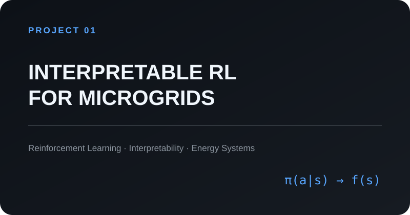
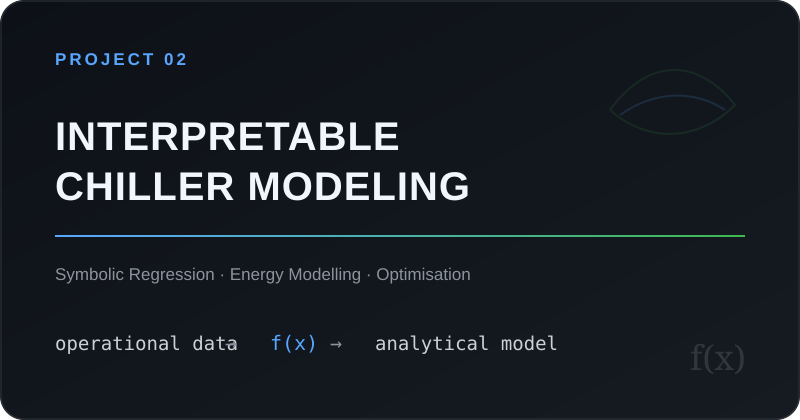
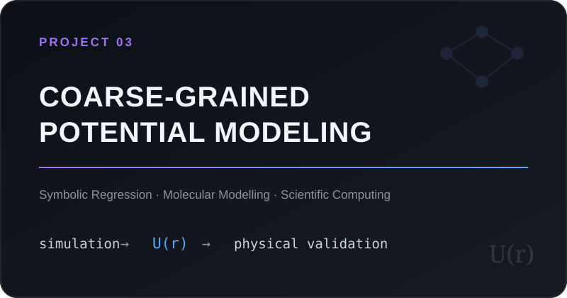
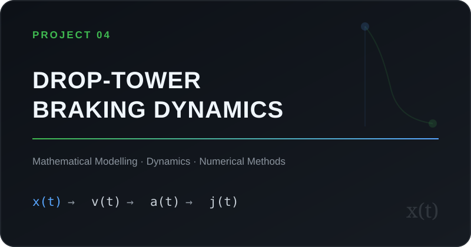

  

  <b>Incoming MPhil in Data Intensive Science · University of Cambridge</b>

  MODEL INTERPRETABILITY × MATHEMATICAL MODELLING

  

---

## About

I am interested in problems at the intersection of **applied mathematics, model interpretability, and data-driven modelling**.

My work explores how mathematical and computational methods can reveal useful structure in **data, physical systems, and complex models**.

---

## 🔍 Research Focus

<table>
<tr>

<td width="50%" valign="top">

<h3>01 · Interpretability & Explainability</h3>

Studying how complex models can be analysed and represented in ways that make their predictions, decisions, and learned behaviour more transparent.

  

<code>Model Interpretability</code> <code>Policy Interpretation</code> <code>Behavioural Analysis</code>

</td>

<td width="50%" valign="top">

<h3>02 · Mathematical & Data-Driven Modelling</h3>

Using mathematical and computational methods to represent and analyse scientific and engineering systems, with an emphasis on structure, physical consistency, and data-driven model construction.

  

<code>Mathematical Modelling</code> <code>Symbolic Regression</code> <code>Optimisation</code>

</td>

</tr>
</table>

---

## 🚀 Selected Projects

<table>

<tr>

<td width="50%" valign="top">

<h3>Interpretable RL for Microgrids</h3>

Investigating interpretable representations of reinforcement-learning policies for constrained energy-management problems.

  

<code>Reinforcement Learning</code> <code>Interpretability</code> <code>Energy Systems</code>

  

<b>Ongoing research</b>

</td>

<td width="50%" valign="top">

<h3>Interpretable Chiller Modeling</h3>

Developing compact analytical models of chiller performance from operational data using symbolic regression, with emphasis on generalisation and physical consistency.

  

<code>Symbolic Regression</code> <code>Energy Modelling</code> <code>Optimisation</code>

  

<a href="https://github.com/zeweyer/Interpretable-Chiller-Modeling">
  <b>View project →</b>
</a>

</td>

</tr>

<tr>

<td width="50%" valign="top">

<h3>Coarse-Grained Potential Modeling</h3>

Discovering analytical interaction potentials from molecular-simulation data while balancing predictive accuracy, mathematical complexity, and physical fidelity.

  

<code>Symbolic Regression</code> <code>Molecular Modelling</code> <code>Scientific Computing</code>

  

<a href="https://github.com/zeweyer/cgpm">
  <b>View project →</b>
</a>

</td>

<td width="50%" valign="top">

<h3>Drop-Tower Braking Dynamics</h3>

Mathematical modelling and numerical simulation of braking dynamics in physical systems.

  

<code>Mathematical Modelling</code> <code>Dynamical Systems</code> <code>Numerical Methods</code>

  

<a href="https://github.com/zeweyer/drop-tower-braking-dynamics">
  <b>View project →</b>
</a>

</td>

</tr>

</table>

---

## 🧰 Methods & Tools

  <code>PySR</code>
  &nbsp; · &nbsp;
  <code>gplearn</code>
  &nbsp; · &nbsp;
  <code>Stable-Baselines3</code>

---

