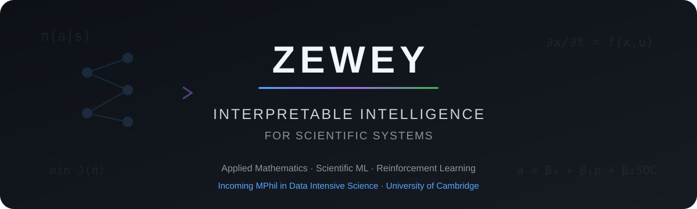

<p align="center">
  
</p>

<p align="center">
  <b>Incoming MPhil in Data Intensive Science @ University of Cambridge</b>
</p>

<p align="center">
  I develop <b>interpretable and mathematically structured machine-learning models</b><br>
  for scientific and engineering systems.
</p>

<p align="center">
  <a href="https://scholar.google.co.uk/citations?user=aMrqOe0AAAAJ">
    
  </a>
</p>

---

## 🔬 Current Research

### Interpretable Reinforcement Learning for Energy Systems

I am currently studying how high-performing deep reinforcement-learning policies can be transformed into **compact, interpretable, and physically meaningful decision rules** for constrained energy-management problems.

```text
                Deep RL Teacher
                       │
                       ▼
                 Safety Layer
                       │
                       ▼
                 Policy Dataset
                       │
              ┌────────┴────────┐
              ▼                 ▼
        Decision Rules     Symbolic Models
              │                 │
              └────────┬────────┘
                       ▼
              Interpretable Policy
                       │
                       ▼
          Safety · Fidelity · Performance
```

`Safe RL` · `SAC` · `Policy Distillation` · `Symbolic Regression` · `Microgrids`

My broader interest is in building data-driven models that are **interpretable, mathematically structured, physically meaningful, and robust**.

---

## 🚀 Featured Research

<table>
<tr>
<td width="50%" valign="top">

<h3>🧠 Interpretable RL for Microgrids</h3>

<p>
Extracting transparent decision policies from deep reinforcement-learning agents for constrained microgrid energy management.
</p>

<b>Research focus</b>

<ul>
<li>Continuous-control reinforcement learning</li>
<li>Analytical safety constraints</li>
<li>Policy distillation</li>
<li>Symbolic policy extraction</li>
<li>Robustness and generalization</li>
</ul>

<b>Methods</b>

<p>
<code>Python</code>
<code>PyTorch</code>
<code>Stable-Baselines3</code>
<code>Symbolic Regression</code>
</p>

<p><b>Ongoing research</b></p>

</td>

<td width="50%" valign="top">

<h3>⚡ Interpretable Chiller Modeling</h3>

<p>
Discovering compact mathematical models of chiller COP using symbolic regression and physics-informed analysis.
</p>

<b>Research focus</b>

<ul>
<li>Physics-informed modeling</li>
<li>Symbolic regression</li>
<li>Model generalization</li>
<li>Accuracy–complexity trade-offs</li>
<li>Closed-form optimization</li>
</ul>

<b>Methods</b>

<p>
<code>Python</code>
<code>PySR</code>
<code>SciPy</code>
<code>scikit-learn</code>
</p>

<p>
<a href="https://github.com/zeweyer/Interpretable-Chiller-Modeling"><b>View repository →</b></a>
</p>

</td>
</tr>

<tr>
<td width="50%" valign="top">

<h3>⚛️ Coarse-Grained Potential Modeling</h3>

<p>
Learning analytical coarse-grained interaction potentials directly from molecular simulation data.
</p>

<b>Research focus</b>

<ul>
<li>Scientific symbolic regression</li>
<li>Molecular dynamics</li>
<li>Pareto model selection</li>
<li>Physical validation</li>
<li>Interpretable force fields</li>
</ul>

<b>Methods</b>

<p>
<code>Python</code>
<code>gplearn</code>
<code>NumPy</code>
<code>SciPy</code>
</p>

<p>
<a href="https://github.com/zeweyer/cgpm"><b>View repository →</b></a>
</p>

</td>

<td width="50%" valign="top">

<h3>🛰️ Drop-Tower Braking Dynamics</h3>

<p>
Physics-based mathematical modeling and numerical simulation of braking dynamics in drop-tower systems.
</p>

<b>Research focus</b>

<ul>
<li>Dynamical systems</li>
<li>Numerical simulation</li>
<li>Physical modeling</li>
<li>Parameter analysis</li>
</ul>

<b>Methods</b>

<p>
<code>MATLAB</code>
<code>Numerical Methods</code>
</p>

<p>
<a href="https://github.com/zeweyer/drop-tower-braking-dynamics"><b>View repository →</b></a>
</p>

</td>
</tr>
</table>

---

## 📐 From Black Boxes to Scientific Models

A recurring theme across my research is turning complex data-driven models into **compact representations that can be inspected, tested, and reasoned about**.

```text
                         DATA
                          │
                          ▼
                 ┌─────────────────┐
                 │  Complex Model  │
                 │   NN / RL / ML  │
                 └────────┬────────┘
                          │
                    interpretation
                          │
                          ▼
               ┌─────────────────────┐
               │  Structured Model   │
               │ equation / rule /   │
               │ constrained policy  │
               └──────────┬──────────┘
                          │
               ┌──────────┼──────────┐
               ▼          ▼          ▼
           Performance  Physics  Interpretability
```

Rather than treating predictive performance as the only objective, I am interested in the trade-offs between **performance, interpretability, complexity, physical consistency, and robustness**.

---

## 🧰 Methods & Tools

<p align="center">


</p>

<p align="center">
  <code>Reinforcement Learning</code>
  ·
  <code>Symbolic Regression</code>
  ·
  <code>Interpretable ML</code>
  ·
  <code>Optimization</code>
  ·
  <code>Scientific Computing</code>
  ·
  <code>Statistical Modeling</code>
</p>

---

## 📫 Connect

<p align="center">
  <a href="https://scholar.google.co.uk/citations?user=aMrqOe0AAAAJ">
    
  </a>
</p>

---

<p align="center">
  <b>Mathematics → Models → Decisions → Understanding</b>
</p>
