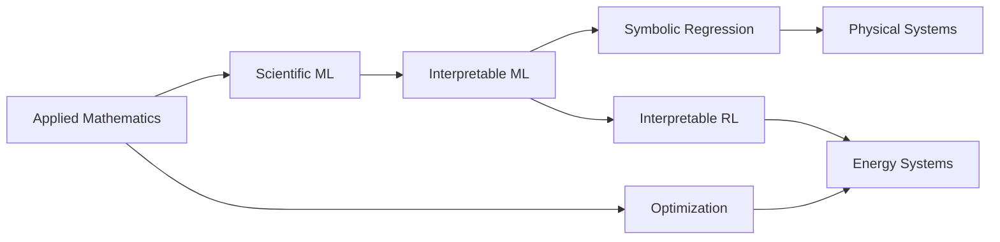

<div align="center">

# Hi, I'm Zewey 👋

### Applied Mathematics × Interpretable Machine Learning × Scientific Computing

**Incoming MPhil in Data Intensive Science @ University of Cambridge**

I build **interpretable and mathematically structured machine-learning models**
for scientific and engineering systems.

<br>

[](https://scholar.google.co.uk/citations?user=aMrqOe0AAAAJ)


</div>

---

## 🔬 Current Research

### Interpretable Reinforcement Learning for Energy Systems

I am currently studying how high-performing deep reinforcement-learning policies can be transformed into **compact, interpretable, and physically meaningful decision rules** for constrained energy-management problems.

```text
Deep RL Teacher
      │
      ▼
 Safety Layer
      │
      ▼
Policy Dataset
      │
      ├──────────────┐
      ▼              ▼
Decision Rules   Symbolic Models
      │              │
      └──────┬───────┘
             ▼
      Interpretable Policy
             │
             ▼
Safety · Fidelity · Performance
```

**Current topics**

`Safe RL` · `SAC` · `PPO` · `Policy Distillation` · `Symbolic Regression` · `Microgrids`

---

## 🧭 Research Interests



My broader interests lie in developing machine-learning models that are:

* **Interpretable** — predictions and decisions can be understood.
* **Mathematically structured** — learned behaviour can be represented by equations, rules, or constraints.
* **Physically meaningful** — models respect the structure of the underlying system.
* **Robust** — models remain useful beyond the data on which they were trained.

---

# 🚀 Featured Research

<table>
<tr>

<td width="50%" valign="top">

### ⚡ Interpretable Chiller Modeling

Symbolic regression for discovering compact mathematical models of chiller COP.

**Research focus**

* Physics-informed modeling
* Symbolic regression
* Model generalization
* Accuracy–complexity trade-offs
* Closed-form optimization

**Methods**

`Python` `PySR` `SciPy` `scikit-learn`

[View repository →](https://github.com/zeweyer/Interpretable-Chiller-Modeling)

</td>

<td width="50%" valign="top">

### ⚛️ Coarse-Grained Potential Modeling

Learning analytical coarse-grained interaction potentials directly from molecular simulation data.

**Research focus**

* Symbolic regression
* Molecular dynamics
* Pareto model selection
* Physical validation
* Interpretable force fields

**Methods**

`Python` `gplearn` `NumPy` `SciPy`

[View repository →](https://github.com/zeweyer/cgpm)

</td>

</tr>

<tr>

<td width="50%" valign="top">

### 🧠 Interpretable RL for Microgrids

Extracting transparent decision policies from deep reinforcement-learning agents for constrained microgrid operation.

**Research focus**

* Continuous-control RL
* Analytical safety constraints
* Policy distillation
* Symbolic policy extraction
* Robustness & generalization

**Methods**

`Python` `PyTorch` `Stable-Baselines3`

**Ongoing research**

</td>

<td width="50%" valign="top">

### 🛰️ Drop-Tower Braking Dynamics

Physics-based mathematical modeling and numerical simulation of braking dynamics.

**Research focus**

* Dynamical systems
* Numerical simulation
* Physical modeling
* Parameter analysis

**Methods**

`MATLAB` `Numerical Methods`

[View repository →](https://github.com/zeweyer/drop-tower-braking-dynamics)

</td>

</tr>
</table>

---

## 📐 From Black Boxes to Scientific Models

A recurring theme in my work is:

```text
                 DATA
                  │
                  ▼
         ┌─────────────────┐
         │ Complex Model   │
         │ NN / RL / ML    │
         └────────┬────────┘
                  │
                  │ interpretation
                  ▼
       ┌─────────────────────┐
       │ Structured Model    │
       │ equation / rule     │
       └──────────┬──────────┘
                  │
        ┌─────────┼─────────┐
        ▼         ▼         ▼
   Accuracy   Physics   Interpretability
```

Rather than treating predictive performance as the only objective, I am interested in the trade-off between **performance, interpretability, complexity, and physical consistency**.

---

## 🧰 Research Toolkit

### Machine Learning


`Reinforcement Learning` · `Symbolic Regression` · `Interpretable ML`

### Scientific Computing


`Optimization` · `Numerical Simulation` · `Statistical Modeling`

### Research Workflow


---

## 📚 Selected Research

**Interpretable modeling of chiller performance**
Symbolic-regression-based modeling of energy-system performance, with emphasis on physical interpretability and generalization.

**Symbolic regression for coarse-grained molecular modeling**
Learning compact interaction potentials from molecular-dynamics data while balancing predictive performance and mathematical complexity.

**Interpretable reinforcement learning for constrained energy management**
Ongoing research into transparent policy extraction from deep RL agents under operational safety constraints.

---

## 📫 Connect

[](https://github.com/zeweyer)
[](https://scholar.google.co.uk/citations?user=aMrqOe0AAAAJ)

---

<div align="center">

### Mathematics → Models → Decisions → Understanding

</div>
